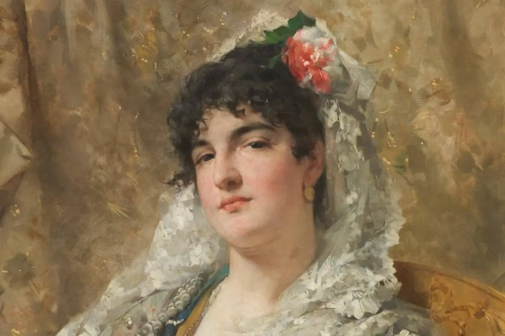

# Dobble



# Index

1. [Project Overview](#project-overview)
2. [The Prado Museum Dataset](#the-prado-museum-dataset)
3. [Launch](#launch)


## Project Overview

The following project is based on works from the Prado Museum:
1. Identify all the existing faces from the art.
2. Encode and store the faces in embeddings.
3. Upload a portrait and get the closest embedding.

By following these steps, the user will be able to see who he/she looks like
in the Prado Museum or even find your Doppelgänger!

The project is divided into two parts: an API that encodes an endpoint to search for the most
and search for the most similar face in the [faces](/faces) directory,
and another part to interact with the user in uploading and displaying the results,
under the [web](/web) directory.


```
├── assets <- Miscellaneous folder, images from the repository
|
├── faces <- Identification and encoding of Prado faces, API service
│
└── web <- Web interface to search a nearest face
```

Each directory contains its own README documenting that specific part,
I encourage you to explore them if you need more information.

## The Prado Museum Dataset

The dataset is available in [Kaggle](https://www.kaggle.com/datasets/maparla/prado-museum-pictures)
where we can access it freely and download it.

## Launch

### Clean temporal images

Once the services have been launched, it is necessary to define a recurring task
to clean the directory where user photos are uploaded.
This is done using Crontab. We can configure it as follows:


```bash
crontab -e
```

One with the editor of your choice, add the following line at the end of the file:

```bash
*/5 * * * * rm -rf /tmp/dobble/*
```
